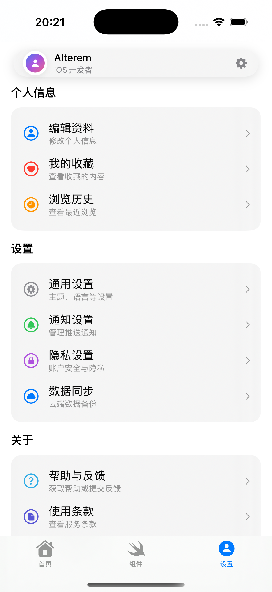
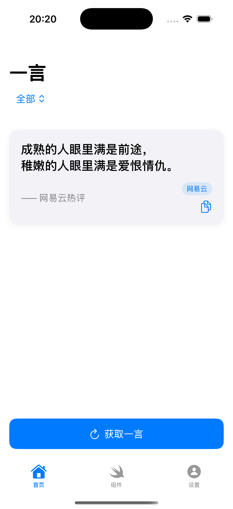
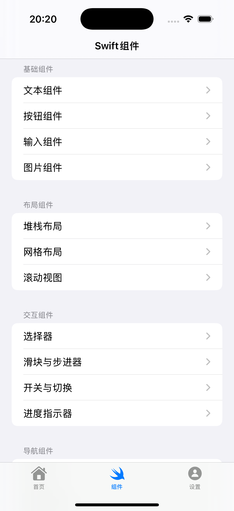
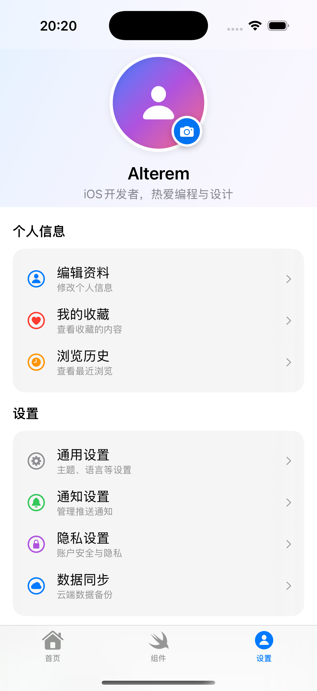

# lite-kit-template - iOS开发模板应用

一个现代化的iOS应用模板，包含3个主要功能页面。

## 功能特性

### 📱 主要页面

1. **首页 - 一言展示**
   - 集成 hitokoto.cn API
   - 支持多种分类选择（动画、漫画、游戏、文学等）
   - 下拉刷新功能
   - 一键复制功能
   - 现代化卡片设计

2. **组件展示页**
   - 全面的Swift UI组件演示
   - 包含文本、按钮、输入框、图片等基础组件
   - 布局组件（Stack、Grid、ScrollView）
   - 交互组件（Picker、Slider、Toggle、Progress）
   - 导航组件（Tab、Alert、Toolbar）
   - 高级组件（Chart、Map、Animation）

3. **个人设置页**
   - 用户头像展示和编辑
   - 相机拍照功能
   - 完整的设置选项
   - 主题切换（深色/浅色模式）
   - 多语言支持
   - 通知设置
   - 数据同步设置

### 🎨 设计特色

- **现代化UI设计**：采用iOS原生设计语言
- **深色模式支持**：完整的主题切换系统
- **响应式布局**：适配不同屏幕尺寸
- **动画效果**：流畅的交互动画
- **SF Symbols图标**：统一的图标风格

### 🛠 技术实现

- **SwiftUI框架**：完全使用SwiftUI构建
- **MVVM架构**：清晰的代码结构
- **Combine框架**：响应式数据绑定
- **网络请求**：URLSession + Combine
- **相机集成**：UIImagePickerController
- **主题管理**：ObservableObject状态管理

## 项目结构

```
lite-kit-template/
├── Models/              # 数据模型
├── Views/               # 视图文件
│   ├── Components/      # 组件演示页面
│   ├── HomeView.swift   # 首页
│   ├── ComponentsView.swift # 组件页
│   ├── ProfileView.swift    # 设置页
│   └── SettingsView.swift   # 详细设置
├── Services/            # 网络服务
├── Managers/            # 管理类
├── Utils/               # 工具类
└── Info.plist          # 权限配置
```

## 权限说明

应用需要以下权限：
- 相机权限：用于拍摄头像
- 相册权限：用于选择头像图片

## 使用说明

1. 克隆项目到本地
2. 使用Xcode打开 `lite-kit-template.xcodeproj`
3. 选择目标设备或模拟器
4. 点击运行按钮即可体验

## 开发环境

- Xcode 15.0+
- iOS 14.0+
- Swift 5.0+

## 功能演示



### 首页一言功能


- 支持获取不同分类的一言内容
- 优雅的卡片式展示
- 一键复制到剪贴板
- 下拉刷新获取新内容

### 组件展示


- 涵盖所有常用SwiftUI组件
- 实际可交互的演示效果
- 清晰的代码示例结构
- 适合学习和参考

### 个人中心


- 完整的用户界面设计
- 相机拍照头像功能
- 丰富的设置选项
- 主题切换实时生效

